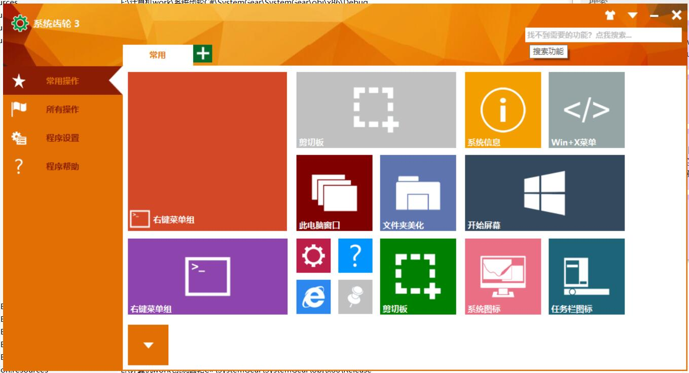
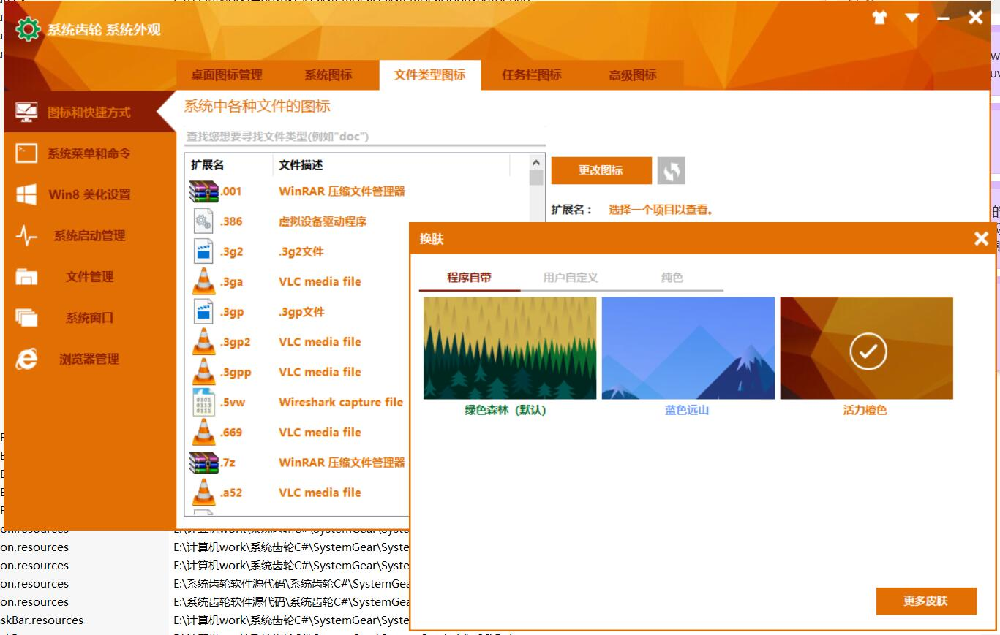
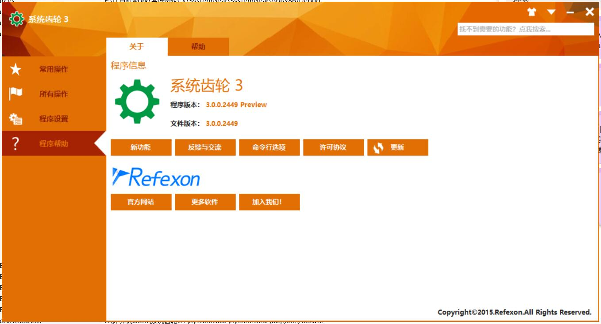

# SystemGear
Features is described in the back page.
# Screenshots
1. Main page

2. Extension icon and software skin changer

3. Interface for ystem icon modification and icon choose dialog

4. About page

# Run
1. Build the release
2. Extract `release_res.zip` into the folder where the executable is.